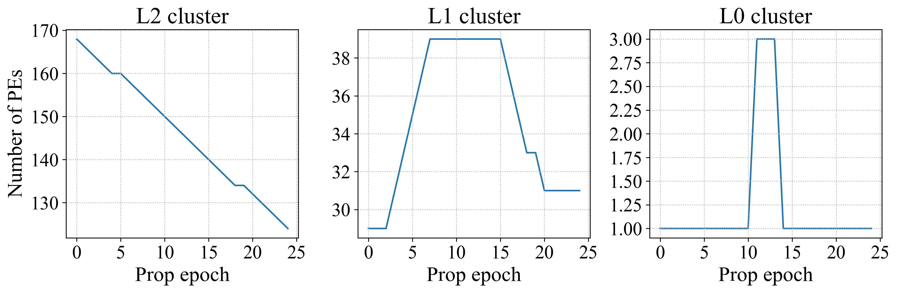
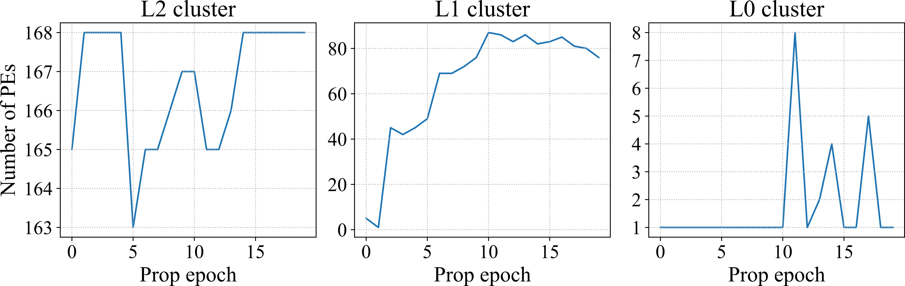
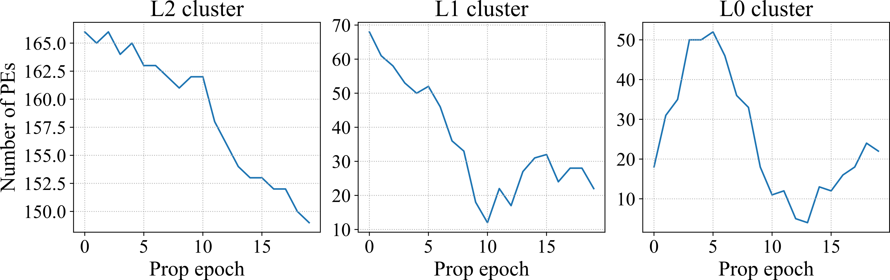
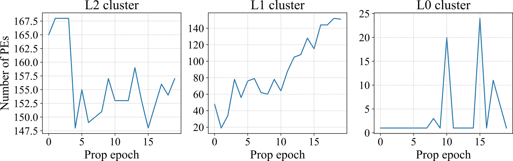

## DCP: Learning Accelerator Dataflow for Neural Network via Propagation

We propose an efficient data-centric approach Dataflow Code Propagation (DCP) to automatically find the optimal dataflow for different DNN layers in seconds without human effort.

### Visualization of Propogation process

In this part, we visualize the dataflow propagation process of DCP for the first layer in ResNet101. We visualize the dataflow in three aspects: the target propagation metric, the number of PEs, and memory size for one cluster of the corresponding memory level (e.g., L2, L1, and L0). Three target metrics (e.g., Latency, Energy, and EDP) are selected to perform single objective optimization, and a multiple objectives optimization for latency and energy is also shown here.

#### Multiple objectives optimization (Latency and Energy)

    
	
    
     
    The change of latency and energy in multiple objectives optimization. The arrow indicates the evolution of the performance of propagated dataflow in each step. The star labels the performance of the final optimized dataflow.
    

 

    
	
    
     
    The change in the number of PEs contained in one L2, L1, and L0 buffer cluster.
    

 

    
	
    
     
    The change of memory size along with propagation epoch. The total on-chip buffer indicates the sum of L2, L1, and L0 buffer.
    

 

#### Single objective optimization (Latency)

    
	
    
     
    The change of latency along with the propagation epoch.
    

 

    
	
    
     
    The change in the number of PEs contained in one L2, L1, and L0 buffer cluster.
    

 

    
	
    
     
    The change of memory size along with propagation epoch. The total on-chip buffer indicates the sum of L2, L1, and L0 buffer.
    

 

#### Single objective optimization (Energy)

    
	
    
     
    The change of energy along with the propagation epoch.
    

 

    
	
    
     
    The change in the number of PEs contained in one L2, L1, and L0 buffer cluster.
    

 

    
	
    
     
    The change of memory size along with propagation epoch. The total on-chip buffer indicates the sum of L2, L1, and L0 buffer.
    

 

#### Single objective optimization (EDP)

    
	
    
     
    The change of EDP along with the propagation epoch.
    

 

    
	
    
     
    The change in the number of PEs contained in one L2, L1, and L0 buffer cluster.
    

 

    
	
    
     
    The change of memory size along with propagation epoch. The total on-chip buffer indicates the sum of L2, L1, and L0 buffer.
    

