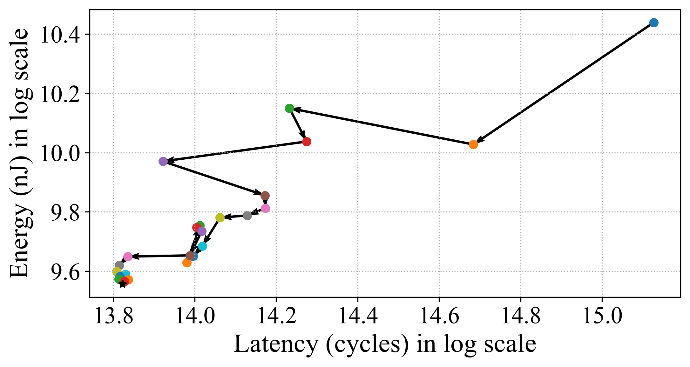
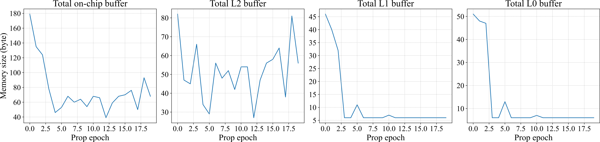

## DCP: Learning Accelerator Dataflow for Neural Network via Propagation

We propose an efficient data-centric approach Dataflow Code Propagation (DCP) to automatically find the optimal dataflow for different DNN layers in seconds without human effort.

### Visualization of Propogation process

In this part, we visualize the dataflow propagation process of DCP for the first layer in ResNet101. We visualize the dataflow in three aspects: the target propagation metric, the number of PEs, and memory size for one cluster of the corresponding memory level (e.g., L2, L1, and L0). Three target metrics (e.g., Latency, Energy, and EDP) are selected to perform single objective optimization, and a multiple objectives optimization for latency and energy is also shown here.

#### Multiple objectives optimization (Latency and Energy)

#### Single objective optimization (Latency)

#### Single objective optimization (Energy)

#### Single objective optimization (EDP)

